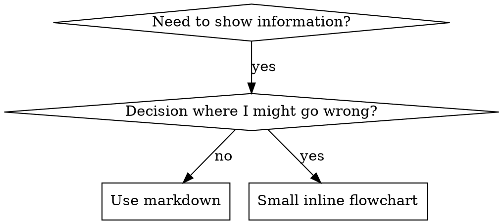

# Skill Creator

Comprehensive guide for creating effective skills using Test-Driven Development.

## Overview

**Creating skills IS Test-Driven Development applied to process documentation.**

Skills are modular, self-contained packages that extend Claude's capabilities by providing specialized knowledge, workflows, and tools. Think of them as "onboarding guides" for specific domains or tasks—they transform Claude from a general-purpose agent into a specialized agent equipped with procedural knowledge that no model can fully possess.

You write test cases (pressure scenarios with subagents), watch them fail (baseline behavior), write the skill (documentation), watch tests pass (agents comply), and refactor (close loopholes).

**Core principle:** If you didn't watch an agent fail without the skill, you don't know if the skill teaches the right thing.

## What is a Skill?

A **skill** is a reference guide for proven techniques, patterns, or tools. Skills help future Claude instances find and apply effective approaches.

**Skills are:** Reusable techniques, patterns, tools, reference guides

**Skills are NOT:** Narratives about how you solved a problem once

## Core Principles

### Test-Driven Development for Skills

**The Iron Law:** No skill without a failing test first.

This applies to NEW skills AND EDITS to existing skills.

Write skill before testing? Delete it. Start over.
Edit skill without testing? Same violation.

**No exceptions:**
- Not for "simple additions"
- Not for "just adding a section"
- Not for "documentation updates"
- Don't keep untested changes as "reference"
- Don't "adapt" while running tests
- Delete means delete

The entire skill creation process follows RED-GREEN-REFACTOR:
- RED: Write failing test (baseline)
- GREEN: Write minimal skill
- REFACTOR: Close loopholes while maintaining compliance

| TDD Concept | Skill Creation |
|-------------|----------------|
| **Test case** | Pressure scenario with subagent |
| **Production code** | Skill document (SKILL.md) |
| **Test fails (RED)** | Agent violates rule without skill (baseline) |
| **Test passes (GREEN)** | Agent complies with skill present |
| **Refactor** | Close loopholes while maintaining compliance |
| **Write test first** | Run baseline scenario BEFORE writing skill |
| **Watch it fail** | Document exact rationalizations agent uses |
| **Minimal code** | Write skill addressing those specific violations |
| **Watch it pass** | Verify agent now complies |
| **Refactor cycle** | Find new rationalizations → plug → re-verify |

### Concise is Key

The context window is a public good. Skills share the context window with everything else Claude needs: system prompt, conversation history, other Skills' metadata, and the actual user request.

**Default assumption: Claude is already very smart.** Only add context Claude doesn't already have. Challenge each piece of information: "Does Claude really need this explanation?" and "Does this paragraph justify its token cost?"

Prefer concise examples over verbose explanations.

### Progressive Disclosure Design Principle

Skills use a three-level loading system to manage context efficiently:

1. **Metadata (name + description)** - Always in context (~100 words)
2. **SKILL.md body** - When skill triggers (<5k words)
3. **Bundled resources** - As needed by Claude (Unlimited because scripts can be executed without reading into context window)

Keep SKILL.md body to the essentials and under 500 lines to minimize context bloat. Split content into separate files when approaching this limit.

### Set Appropriate Degrees of Freedom

Match the level of specificity to the task's fragility and variability:

**High freedom (text-based instructions)**: Use when multiple approaches are valid, decisions depend on context, or heuristics guide the approach.

**Medium freedom (pseudocode or scripts with parameters)**: Use when a preferred pattern exists, some variation is acceptable, or configuration affects behavior.

**Low freedom (specific scripts, few parameters)**: Use when operations are fragile and error-prone, consistency is critical, or a specific sequence must be followed.

Think of Claude as exploring a path: a narrow bridge with cliffs needs specific guardrails (low freedom), while an open field allows many routes (high freedom).

## What Skills Provide

1. Specialized workflows - Multi-step procedures for specific domains
2. Tool integrations - Instructions for working with specific file formats or APIs
3. Domain expertise - Company-specific knowledge, schemas, business logic
4. Bundled resources - Scripts, references, and assets for complex and repetitive tasks

## Skill Anatomy

Every skill consists of a required SKILL.md file and optional bundled resources:

```
skill-name/
├── SKILL.md (required)
│   ├── YAML frontmatter metadata (required)
│   │   ├── name: (required)
│   │   ├── description: (required)
│   │   ├── version: (optional but recommended)
│   │   └── license: (optional)
│   └── Markdown instructions (required)
└── Bundled Resources (optional)
    ├── scripts/          - Executable code (Python/Bash/etc.)
    ├── references/       - Documentation intended to be loaded into context as needed
    └── assets/           - Files used in output (templates, icons, fonts, etc.)
```

### SKILL.md (required)

Every SKILL.md consists of:

- **Frontmatter** (YAML): Contains `name`, `description`, and optional fields like `version` and `license`. These are the fields that Claude reads to determine when the skill gets used, thus it is very important to be clear and comprehensive in describing what the skill is, and when it should be used.
- **Body** (Markdown): Instructions and guidance for using the skill. Only loaded AFTER the skill triggers (if at all).

### Bundled Resources (optional)

#### Scripts (`scripts/`)

Executable code (Python/Bash/etc.) for tasks that require deterministic reliability or are repeatedly rewritten.

- **When to include**: When the same code is being rewritten repeatedly or deterministic reliability is needed
- **Example**: `scripts/rotate_pdf.py` for PDF rotation tasks
- **Benefits**: Token efficient, deterministic, may be executed without loading into context
- **Note**: Scripts may still need to be read by Claude for patching or environment-specific adjustments

#### References (`references/`)

Documentation and reference material intended to be loaded as needed into context to inform Claude's process and thinking.

- **When to include**: For documentation that Claude should reference while working
- **Examples**: `references/finance.md` for financial schemas, `references/mnda.md` for company NDA template, `references/policies.md` for company policies, `references/api_docs.md` for API specifications
- **Use cases**: Database schemas, API documentation, domain knowledge, company policies, detailed workflow guides
- **Benefits**: Keeps SKILL.md lean, loaded only when Claude determines it's needed
- **Best practice**: If files are large (>10k words), include grep search patterns in SKILL.md
- **Avoid duplication**: Information should live in either SKILL.md or references files, not both. Prefer references files for detailed information unless it's truly core to the skill—this keeps SKILL.md lean while making information discoverable without hogging the context window. Keep only essential procedural instructions and workflow guidance in SKILL.md; move detailed reference material, schemas, and examples to references files.

##### Progressive Disclosure Patterns

When splitting out content into other files, it is very important to reference them from SKILL.md and describe clearly when to read them, to ensure the reader of the skill knows they exist and when to use them.

**Key principle:** When a skill supports multiple variations, frameworks, or options, keep only the core workflow and selection guidance in SKILL.md. Move variant-specific details (patterns, examples, configuration) into separate reference files.

**Pattern 1: High-level guide with references**

```markdown
# PDF Processing

## Quick start

Extract text with pdfplumber:
[code example]

## Advanced features

- **Form filling**: See [FORMS.md](FORMS.md) for complete guide
- **API reference**: See [REFERENCE.md](REFERENCE.md) for all methods
- **Examples**: See [EXAMPLES.md](EXAMPLES.md) for common patterns
```

Claude loads FORMS.md, REFERENCE.md, or EXAMPLES.md only when needed.

**Pattern 2: Domain-specific organization**

For Skills with multiple domains, organize content by domain to avoid loading irrelevant context:

```
bigquery-skill/
├── SKILL.md (overview and navigation)
└── reference/
    ├── finance.md (revenue, billing metrics)
    ├── sales.md (opportunities, pipeline)
    ├── product.md (API usage, features)
    └── marketing.md (campaigns, attribution)
```

When a user asks about sales metrics, Claude only reads sales.md.

Similarly, for skills supporting multiple frameworks or variants, organize by variant:

```
cloud-deploy/
├── SKILL.md (workflow + provider selection)
└── references/
    ├── aws.md (AWS deployment patterns)
    ├── gcp.md (GCP deployment patterns)
    └── azure.md (Azure deployment patterns)
```

When the user chooses AWS, Claude only reads aws.md.

**Pattern 3: Conditional details**

Show basic content, link to advanced content:

```markdown
# DOCX Processing

## Creating documents

Use docx-js for new documents. See [DOCX-JS.md](DOCX-JS.md).

## Editing documents

For simple edits, modify the XML directly.

**For tracked changes**: See [REDLINING.md](REDLINING.md)
**For OOXML details**: See [OOXML.md](OOXML.md)
```

Claude reads REDLINING.md or OOXML.md only when the user needs those features.

**Important guidelines:**

- **Avoid deeply nested references** - Keep references one level deep from SKILL.md. All reference files should link directly from SKILL.md.
- **Structure longer reference files** - For files longer than 100 lines, include a table of contents at the top so Claude can see the full scope when previewing.

#### Assets (`assets/`)

Files not intended to be loaded into context, but rather used within the output Claude produces.

- **When to include**: When the skill needs files that will be used in the final output
- **Examples**: `assets/logo.png` for brand assets, `assets/slides.pptx` for PowerPoint templates, `assets/frontend-template/` for HTML/React boilerplate, `assets/font.ttf` for typography
- **Use cases**: Templates, images, icons, boilerplate code, fonts, sample documents that get copied or modified
- **Benefits**: Separates output resources from documentation, enables Claude to use files without loading them into context

#### What to Not Include in a Skill

A skill should only contain essential files that directly support its functionality. Do NOT create extraneous documentation or auxiliary files, including:

- README.md
- INSTALLATION_GUIDE.md
- QUICK_REFERENCE.md
- CHANGELOG.md
- etc.

The skill should only contain the information needed for an AI agent to do the job at hand. It should not contain auxilary context about the process that went into creating it, setup and testing procedures, user-facing documentation, etc. Creating additional documentation files just adds clutter and confusion.

## When to Create a Skill

**Create when:**
- Technique wasn't intuitively obvious to you
- You'd reference this again across projects
- Pattern applies broadly (not project-specific)
- Others would benefit

**Don't create for:**
- One-off solutions
- Standard practices well-documented elsewhere
- Project-specific conventions (put in CLAUDE.md or repo-specific instructions)

## Skill Types

### Technique
Concrete method with steps to follow (condition-based-waiting, root-cause-tracing)

### Pattern
Way of thinking about problems (flatten-with-flags, test-invariants)

### Reference
API docs, syntax guides, tool documentation (office docs)

## Skill Creation Process

Skill creation follows a TDD-based workflow that combines testing methodology with practical implementation:

### Step 1: Understand the Skill with Concrete Examples

Skip this step only when the skill's usage patterns are already clearly understood. It remains valuable even when working with an existing skill.

To create an effective skill, clearly understand concrete examples of how the skill will be used. This understanding can come from either direct user examples or generated examples that are validated with user feedback.

For example, when building an image-editor skill, relevant questions include:

- "What functionality should the image-editor skill support? Editing, rotating, anything else?"
- "Can you give some examples of how this skill would be used?"
- "I can imagine users asking for things like 'Remove the red-eye from this image' or 'Rotate this image'. Are there other ways you imagine this skill being used?"
- "What would a user say that should trigger this skill?"

To avoid overwhelming users, avoid asking too many questions in a single message. Start with the most important questions and follow up as needed for better effectiveness.

Conclude this step when there is a clear sense of the functionality the skill should support.

### Step 2: Plan Reusable Skill Contents

To turn concrete examples into an effective skill, analyze each example by:

1. Considering how to execute on the example from scratch
2. Identifying what scripts, references, and assets would be helpful when executing these workflows repeatedly

Example: When building a `pdf-editor` skill to handle queries like "Help me rotate this PDF," the analysis shows:

1. Rotating a PDF requires re-writing the same code each time
2. A `scripts/rotate_pdf.py` script would be helpful to store in the skill

Example: When designing a `frontend-webapp-builder` skill for queries like "Build me a todo app" or "Build me a dashboard to track my steps," the analysis shows:

1. Writing a frontend webapp requires the same boilerplate HTML/React each time
2. An `assets/hello-world/` template containing the boilerplate HTML/React project files would be helpful to store in the skill

Example: When building a `big-query` skill to handle queries like "How many users have logged in today?" the analysis shows:

1. Querying BigQuery requires re-discovering the table schemas and relationships each time
2. A `references/schema.md` file documenting the table schemas would be helpful to store in the skill

To establish the skill's contents, analyze each concrete example to create a list of the reusable resources to include: scripts, references, and assets.

### Step 3: RED - Write Failing Test (Baseline)

**Skip this step only when editing an existing skill and the behavior is well-understood. For new skills, this step is mandatory.**

Run pressure scenario with subagent WITHOUT the skill. Document exact behavior:

- What choices did they make?
- What rationalizations did they use (verbatim)?
- Which pressures triggered violations?

This is "watch the test fail" - you must see what agents naturally do before writing the skill.

For discipline-enforcing skills (like TDD, verification requirements), use multiple combined pressures:
- Time pressure
- Sunk cost
- Authority pressure
- Exhaustion

Identify patterns in rationalizations and failures. This baseline documentation becomes your roadmap for what the skill must address.

### Step 4: GREEN - Write Minimal Skill

Write skill that addresses those specific rationalizations. Don't add extra content for hypothetical cases.

When editing the (newly-generated or existing) skill, remember that the skill is being created for another instance of Claude to use. Include information that would be beneficial and non-obvious to Claude. Consider what procedural knowledge, domain-specific details, or reusable assets would help another Claude instance execute these tasks more effectively.

#### Initialize the Skill (if creating new)

Skip this step only if the skill being developed already exists, and iteration or packaging is needed. In this case, continue to editing the SKILL.md.

When creating a new skill from scratch, always run the `init_skill.py` script. The script conveniently generates a new template skill directory that automatically includes everything a skill requires, making the skill creation process much more efficient and reliable.

Usage:

```bash
scripts/init_skill.py <skill-name> --path <output-directory>
```

The script:

- Creates the skill directory at the specified path
- Generates a SKILL.md template with proper frontmatter and TODO placeholders
- Creates example resource directories: `scripts/`, `references/`, and `assets/`
- Adds example files in each directory that can be customized or deleted

After initialization, customize or remove the generated SKILL.md and example files as needed.

#### Write SKILL.md

**Writing Guidelines:** Always use imperative/infinitive form.

##### Frontmatter

Write the YAML frontmatter with `name` and `description`:

- `name`: The skill name (kebab-case)
- `version`: Semantic version (recommended: 5.1.0)
- `license`: License information (optional)
- `description`: This is the primary triggering mechanism for your skill, and helps Claude understand when to use the skill.
  - Include both what the Skill does and specific triggers/contexts for when to use it.
  - Include all "when to use" information here - Not in the body. The body is only loaded after triggering, so "When to Use This Skill" sections in the body are not helpful to Claude.
  - Use TDD principles: Write rich, specific when_to_use that describes problems and triggers, not just the task
  - Example description for a `docx` skill: "Comprehensive document creation, editing, and analysis with support for tracked changes, comments, formatting preservation, and text extraction. Use when Claude needs to work with professional documents (.docx files) for: (1) Creating new documents, (2) Modifying or editing content, (3) Working with tracked changes, (4) Adding comments, or any other document tasks"

**Claude Search Optimization (CSO):**

Critical for discovery: Future Claude needs to FIND your skill.

**Rich when_to_use:**
- Start with "when" to complete "Use [skill-path] when [your text]"
- Use concrete triggers, symptoms, and situations that signal this skill applies
- Describe the *problem* (race conditions, inconsistent behavior) not *language-specific symptoms* (setTimeout, sleep)
- Keep triggers technology-agnostic unless the skill itself is technology-specific

**Keyword Coverage:**
- Use words Claude would search for: error messages, symptoms, synonyms, tools
- Mention key concepts multiple times: in description, when_to_use, overview, section headers

**Descriptive Naming:**
- Use active voice, verb-first: `creating-skills`, not `skill-creation`
- Name by what you DO or core insight: `condition-based-waiting` > `async-test-helpers`

**Token Efficiency (Critical):**
getting-started and frequently-referenced skills load into EVERY conversation. Every token counts.

- Target word counts: getting-started workflows <150 words, frequently-loaded skills <200 words, other skills <500 words
- Move details to tool help: reference `--help` instead of documenting all flags
- Use cross-references: link to other skills instead of repeating workflows
- Compress examples: minimal examples show the pattern
- Eliminate redundancy: don't repeat what's in cross-referenced skills
- Verification: `wc -w skills/path/SKILL.md` to check word count

##### Body

Write instructions for using the skill and its bundled resources.

**Learn Proven Design Patterns:**

Consult these helpful guides based on your skill's needs:

- **Multi-step processes**: See [references/workflows.md](references/workflows.md) for sequential workflows and conditional logic
- **Specific output formats or quality standards**: See [references/output-patterns.md](references/output-patterns.md) for template and example patterns

These files contain established best practices for effective skill design.

**Start with Reusable Skill Contents:**

To begin implementation, start with the reusable resources identified above: `scripts/`, `references/`, and `assets/` files. Note that this step may require user input. For example, when implementing a `brand-guidelines` skill, the user may need to provide brand assets or templates to store in `assets/`, or documentation to store in `references/`.

Added scripts must be tested by actually running them to ensure there are no bugs and that the output matches what is expected. If there are many similar scripts, only a representative sample needs to be tested to ensure confidence that they all work while balancing time to completion.

Any example files and directories not needed for the skill should be deleted. The initialization script creates example files in `scripts/`, `references/`, and `assets/` to demonstrate structure, but most skills won't need all of them.

**Address Specific Baseline Failures:**

The skill must directly address the specific rationalizations and failures identified in the RED phase (Step 3). Don't write generic guidance—write specific counters to the exact behavior you observed.

**Code inline OR @link to separate file:**

- Keep code inline if: < 50 lines, pattern-focused, reusable
- Link to separate file if: Heavy reference (100+ lines), reusable tools, comprehensive API docs

**One excellent example beats many mediocre ones:**

Choose most relevant language for examples. The example should be:
- Complete and runnable
- Well-commented explaining WHY
- From real scenario
- Shows pattern clearly
- Ready to adapt (not generic template)

Don't implement in 5+ languages or create fill-in-the-blank templates. You're good at porting - one great example is enough.

**Run same scenarios WITH skill - verify agents now comply.**

### Step 5: REFACTOR - Close Loopholes

Agent found new rationalization? Add explicit counter. Re-test until bulletproof.

**Close Every Loophole Explicitly:**

Don't just state the rule - forbid specific workarounds:

<Bad>
```markdown
Write code before test? Delete it.
```
</Bad>

<Good>
```markdown
Write code before test? Delete it. Start over.

**No exceptions:**
- Don't keep it as "reference"
- Don't "adapt" it while writing tests
- Don't look at it
- Delete means delete
```
</Good>

**Address "Spirit vs Letter" Arguments:**

Add foundational principle early:

```markdown
**Violating the letter of the rules is violating the spirit of the rules.**
```

This cuts off entire class of "I'm following the spirit" rationalizations.

**Build Rationalization Table:**

Capture rationalizations from baseline testing (see Step 3). Every excuse agents make goes in the table:

```markdown
| Excuse | Reality |
|--------|---------|
| "Too simple to test" | Simple code breaks. Test takes 30 seconds. |
| "I'll test after" | Tests passing immediately prove nothing. |
| "Tests after achieve the same purpose" | Tests-after = "what does this do?" Tests-first = "what should this do?" |
```

**Create Red Flags List:**

Make it easy for agents to self-check when rationalizing:

```markdown
## Red Flags - STOP and Start Over

- Code before test
- "I already manually tested it"
- "Tests after achieve the same purpose"
- "It's about spirit not ritual"
- "This is different because..."

**All of these mean: Delete code. Start over with TDD.**
```

**Update CSO for Violation Symptoms:**

Add to description: symptoms of when you're ABOUT to violate the rule.

**See [references/persuasion-principles.md](references/persuasion-principles.md)** for research foundation (Cialdini, 2021; Meincke et al., 2025) on authority, commitment, scarcity, social proof, and unity principles for bulletproofing skills against rationalization.

### Step 6: Package the Skill

Once development of the skill is complete, it must be packaged into a distributable .skill file that gets shared with the user. The packaging process automatically validates the skill first to ensure it meets all requirements:

```bash
scripts/package_skill.py <path/to/skill-folder>
```

Optional output directory specification:

```bash
scripts/package_skill.py <path/to/skill-folder> ./dist
```

The packaging script will:

1. **Validate** the skill automatically, checking:

   - YAML frontmatter format and required fields
   - Skill naming conventions and directory structure
   - Description completeness and quality
   - File organization and resource references

2. **Package** the skill if validation passes, creating a .skill file named after the skill (e.g., `my-skill.skill`) that includes all files and maintains the proper directory structure for distribution. The .skill file is a zip file with a .skill extension.

If validation fails, the script will report the errors and exit without creating a package. Fix any validation errors and run the packaging command again.

### Step 7: Iterate

After testing the skill, users may request improvements. Often this happens right after using the skill, with fresh context of how the skill performed.

**Iteration workflow:**

1. Use the skill on real tasks
2. Notice struggles or inefficiencies
3. Identify how SKILL.md or bundled resources should be updated
4. Implement changes and test again

## Testing Skills

Different skill types need different test approaches:

### Discipline-Enforcing Skills (rules/requirements)

**Examples:** TDD, verification-before-completion, designing-before-coding

**Test with:**
- Academic questions: Do they understand the rules?
- Pressure scenarios: Do they comply under stress?
- Multiple pressures combined: time + sunk cost + exhaustion
- Identify rationalizations and add explicit counters

**Success criteria:** Agent follows rule under maximum pressure

### Technique Skills (how-to guides)

**Examples:** condition-based-waiting, root-cause-tracing, defensive-programming

**Test with:**
- Application scenarios: Can they apply the technique correctly?
- Variation scenarios: Do they handle edge cases?
- Missing information tests: Do instructions have gaps?

**Success criteria:** Agent successfully applies technique to new scenario

### Pattern Skills (mental models)

**Examples:** reducing-complexity, information-hiding concepts

**Test with:**
- Recognition scenarios: Do they recognize when pattern applies?
- Application scenarios: Can they use the mental model?
- Counter-examples: Do they know when NOT to apply?

**Success criteria:** Agent correctly identifies when/how to apply pattern

### Reference Skills (documentation/APIs)

**Examples:** API documentation, command references, library guides

**Test with:**
- Retrieval scenarios: Can they find the right information?
- Application scenarios: Can they use what they found correctly?
- Gap testing: Are common use cases covered?

**Success criteria:** Agent finds and correctly applies reference information

## Common Rationalizations for Skipping Testing

| Excuse | Reality |
|--------|---------|
| "Skill is obviously clear" | Clear to you ≠ clear to other agents. Test it. |
| "It's just a reference" | References can have gaps, unclear sections. Test retrieval. |
| "Testing is overkill" | Untested skills have issues. Always. 15 min testing saves hours. |
| "I'll test if problems emerge" | Problems = agents can't use skill. Test BEFORE deploying. |
| "Too tedious to test" | Testing is less tedious than debugging bad skill in production. |
| "I'm confident it's good" | Overconfidence guarantees issues. Test anyway. |
| "Academic review is enough" | Reading ≠ using. Test application scenarios. |
| "No time to test" | Deploying untested skill wastes more time fixing it later. |

**All of these mean: Test before deploying. No exceptions.**

## Flowchart Usage

**Use flowcharts ONLY for:**
- Non-obvious decision points
- Process loops where you might stop too early
- "When to use A vs B" decisions

**Never use flowcharts for:**
- Reference material → Tables, lists
- Code examples → Markdown blocks
- Linear instructions → Numbered lists
- Labels without semantic meaning (step1, helper2)

**Example inline flowchart:**



**See [references/graphviz-conventions.dot](references/graphviz-conventions.dot)** for complete graphviz style rules, including:
- Node type shapes (diamond for questions, box for actions, plaintext for commands, ellipse for states, octagon for warnings, doublecircle for entry/exit)
- Edge labeling conventions (yes/no, specific conditions, dotted for triggers)
- Naming patterns (questions end with ?, actions start with verb, commands are literal, states describe situation)
- Good vs bad examples

## File Organization Patterns

### Self-Contained Skill
```
defense-in-depth/
  SKILL.md    # Everything inline
```
When: All content fits, no heavy reference needed

### Skill with Reusable Tool
```
condition-based-waiting/
  SKILL.md    # Overview + patterns
  example.ts  # Working helpers to adapt
```
When: Tool is reusable code, not just narrative

### Skill with Heavy Reference
```
pptx/
  SKILL.md       # Overview + workflows
  pptxgenjs.md   # 600 lines API reference
  ooxml.md       # 500 lines XML structure
  scripts/       # Executable tools
```
When: Reference material too large for inline

## Writing Style Guidelines

### Content Repetition

Mention key concepts multiple times:
- In description
- In when_to_use
- In overview
- In section headers

Grep hits from multiple places = easier discovery

### Cross-Referencing Other Skills

**When writing documentation that references other skills:**

Use path format without `@` prefix or `/SKILL.md` suffix:
- ✅ Good: `skills/testing/test-driven-development`
- ✅ Good: `skills/debugging/systematic-debugging`
- ❌ Bad: `@skills/testing/test-driven-development/SKILL.md` (force-loads, burns context)

**Why no @ links:** `@` syntax force-loads files immediately, consuming 200k+ context before you need them.

**To read a skill reference:** Use Read tool on `${SUPERPOWERS_SKILLS_ROOT}/category/skill-name/SKILL.md`

## Skill Creation Checklist (TDD Adapted)

**IMPORTANT: Use TodoWrite to create todos for EACH checklist item below.**

**Phase 1 - RED: Write Failing Test:**
- [ ] Create pressure scenarios (3+ combined pressures for discipline skills)
- [ ] Run scenarios WITHOUT skill - document baseline behavior verbatim
- [ ] Identify patterns in rationalizations/failures

**Phase 2 - GREEN: Write Minimal Skill:**
- [ ] Name describes what you DO or core insight
- [ ] YAML frontmatter with rich when_to_use (include symptoms!)
- [ ] Keywords throughout for search (errors, symptoms, tools)
- [ ] Clear overview with core principle
- [ ] Address specific baseline failures identified in RED
- [ ] Code inline OR @link to separate file
- [ ] One excellent example (not multi-language)
- [ ] Run scenarios WITH skill - verify agents now comply

**Phase 3 - REFACTOR: Close Loopholes:**
- [ ] Identify NEW rationalizations from testing
- [ ] Add explicit counters (if discipline skill)
- [ ] Build rationalization table from all test iterations
- [ ] Create red flags list
- [ ] Re-test until bulletproof

**Phase 4 - Quality Checks:**
- [ ] Small flowchart only if decision non-obvious
- [ ] Quick reference table
- [ ] Common mistakes section
- [ ] No narrative storytelling
- [ ] Supporting files only for tools or heavy reference
- [ ] Token efficiency checked (wc -w SKILL.md)
- [ ] File organization appropriate (self-contained / tool / heavy reference)

**Phase 5 - Deployment:**
- [ ] Package skill with scripts/package_skill.py
- [ ] Consider contributing back via PR (if broadly useful)

## Anti-Patterns

### ❌ Narrative Example
"In session 2025-10-03, we found empty projectDir caused..."
**Why bad:** Too specific, not reusable

### ❌ Multi-Language Dilution
example-js.js, example-py.py, example-go.go
**Why bad:** Mediocre quality, maintenance burden

### ❌ Code in Flowcharts
```dot
step1 [label="import fs"];
step2 [label="read file"];
```
**Why bad:** Can't copy-paste, hard to read

### ❌ Generic Labels
helper1, helper2, step3, pattern4
**Why bad:** Labels should have semantic meaning

## STOP: Before Moving to Next Skill

**After writing ANY skill, you MUST STOP and complete the deployment process.**

**Do NOT:**
- Create multiple skills in batch without testing each
- Move to next skill before current one is verified
- Skip testing because "batching is more efficient"

**The deployment checklist above is MANDATORY for EACH skill.**

Deploying untested skills = deploying untested code. It's a violation of quality standards.

## Discovery Workflow

How future Claude finds your skill:

1. **Encounters problem** ("tests are flaky")
2. **Searches skills** using `find-skills` tool (searches skills repository)
3. **Finds SKILL.md** (rich when_to_use matches)
4. **Scans overview** (is this relevant?)
5. **Reads patterns** (quick reference table)
6. **Loads example** (only when implementing)

**Optimize for this flow** - put searchable terms early and often.

## The Bottom Line

**Creating skills IS TDD for process documentation.**

Same Iron Law: No skill without failing test first.
Same cycle: RED (baseline) → GREEN (write skill) → REFACTOR (close loopholes).
Same benefits: Better quality, fewer surprises, bulletproof results.

If you follow TDD for code, follow it for skills. It's the same discipline applied to documentation.
